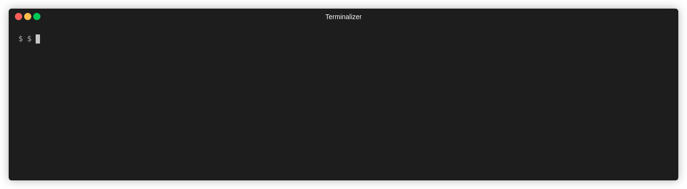

# API-template

# API

| Method | Endpoint | Headers | Body | Query params | Response |
| --- | --- | --- | --- | --- | --- |
| POST | /users/signup |  | email
password |  |  |
| POST | /users/signin | credentials : include | email
password |  |  |
| DELETE | /users/:userId | credentials : include |  | userId |  |
| POST | /users/signout | credentials : include |  |  |  |
| GET | /users/:userId/profiles/:profileId | credentials : include |  | userId
profileId | id : string
fst_name : string
last_name : string
position : string
company : string
city : string |
| PATCH | /users/:userId/profiles/:profileId | credentials : include | id : string
fst_name : string
last_name : string
position : string
company : string
city : string | userId
profileId |  |
| GET | /users/:userId/experiences | credentials : include |  | userId | companies[{
  id : string
  position : string
  company : string
  city : string
}] |
| GET | /users/:userId/experiences/:experienceId | credentials : include |  | userId
experienceId | id : string
position : string
company : string
city : string |
| POST | /users/:userId/experiences | credentials : include | id : string
position : string
company : string
city : string | userId
experienceId |  |
| PATCH | /users/:userId/experiences/:experienceId | credentials : include | id : string
position : string
company : string
city : string | userId
experienceId |  |
| DELETE | /users/:userId/experiences/:experienceId | credentials : include |  | userId
experienceId |  |
| GET | /users/:userId/competences | credentials : include |  | userId | competences[{
  id : string
  name : string
}] |
| GET | /users/:userId/competences/:competenceId | credentials : include |  | userId
competenceId | id : string
name : string |
| POST | /users/:userId/competences | credentials : include | id : string
name : string | userId |  |
| DELETE | /users/:userId/competences/:competenceId | credentials : include |  | userId
competenceId |  |
| GET | /users/:userId/companies | credentials : include |  |  | companies[{
  id : string
  name : string
  domain : string
  adress : string
}] |
| GET | /users/:userId/companies/:companyId | credentials : include |  | companyId | id : string
name : string
domain : string
adress : string |
| POST | /users/:userId/companies/ | credentials : include | id : string
name : string
domain : string
adress : string |  |  |
| PATCH | /users/:userId/companies/:companyId | credentials : include | id : string
name : string
domain : string
adress : string | companyId |  |
| DELETE | /users/:userId/companies/:companyId | credentials : include |  | companyId |  |
| GET | /users/:userId/companies/:companyId/employees | credentials : include |  |  | employees[{
  id : string
  name : string
}] |
| POST  | /users/:userId/companies/:companyId/employees | credentials : include | userId : string
companyId : string |  |  |
| DELETE | /users/:userId/companies/:companyId/employees | credentials : include |  |  |  |

# What is it ?

The purpose of this template is to provide a **typesafe**, **production ready** web API, and a full **development environment** with the best tooling possible

It gives your project a clean base to start and follows development **good practices**, essentially focusing on **maintenability** and **extensibility**

Lastly, it aims to save developers a lot of time since all **nasty configurations** are already written (typescript, eslint, jest, docker, CI, ...) and **technologies** are already chosen (language, testing framework, database, ORM, ...)

> This project is fully integrated with **[devops-template](https://github.com/LeChatErrant/devops-template)** **(work still in progress)**, which provide a full infrastructure on Kubernetes along with its tooling
>
> Don't hesitate to share your improvements or to give feedback on Discord **(LeChatErrant#6074)** :wink:

<!-- START doctoc generated TOC please keep comment here to allow auto update -->
<!-- DON'T EDIT THIS SECTION, INSTEAD RE-RUN doctoc TO UPDATE -->
# Table of contents

- [Getting started](#getting-started)
- [Technologies](#technologies)
- [CLI](#cli)
- [Documentation](#documentation)
- [How to reuse this template](#how-to-reuse-this-template)
- [Work in progress](#work-in-progress)
- [How to contribute](#how-to-contribute)
  - [Contributors](#contributors)

<!-- END doctoc generated TOC please keep comment here to allow auto update -->

# Getting started

1. Make sure the **[.envrc](/.envrc)** is loaded (have a look **[here](https://github.com/LeChatErrant/API-template/wiki/Getting-started#Configuration)**)
2. Install dependencies with `npm install`
3. If no database is running, simply launch one locally with `npm run dev:db`
4. Run `npm run dev`

# Technologies

 - [Typescript](https://www.typescriptlang.org/)
 - [Express](https://expressjs.com/)
 - [Prisma (ORM)](https://www.prisma.io/)
 - [Bcrypt (password hash)](https://www.npmjs.com/package/bcrypt)
 - [Eslint (styling)](https://eslint.org/)
 - [Jest (testing)](https://jestjs.io/)
 - [Supertest (testing)](https://www.npmjs.com/package/supertest)
 - [Husky (pre commit hooks)](https://typicode.github.io/husky/#/)
 - [Github action (CI/CD)](https://github.com/features/actions)
 - [Redis (session management)](https://redis.io/)
 - [Docker](https://www.docker.com/)

...and more

# CLI

The template comes with a **[Command-Line Interface](https://github.com/LeChatErrant/templated-project-cli)** that helps you to **initialize**, **develop** and **maintain** your projects. It saves you from writing boilerplate code 

> The CLI is currently under heavy development, new features will be release soon ❤️
> 
> More details in **[wiki](https://github.com/LeChatErrant/API-template/wiki/CLI)**

# Documentation

Documentation can be found in the **[wiki](https://github.com/LeChatErrant/API-template/wiki)**

# How to reuse this template

This repository is **templated** : try using it as a base for your own projects by clicking on the **[Use this template](https://github.com/LeChatErrant/API-template/generate)**

# Work in progress

 - [ ] CLI to create, extend and manage API resources
 - [ ] Auto generated code documentation
 - [ ] Integration with Prisma seeders
 - [ ] Back office template

# How to contribute

1. Fork it (**<https://github.com/LeChatErrant/API-template/fork>**)
2. Create your feature branch (`git checkout -b my-new-feature`)
3. Commit your changes (`git commit -am 'Add some feature'`)
4. Push to the branch (`git push origin my-new-feature`)
5. Create a new Pull Request

Issues and comments welcomed ! :wink:

## Contributors

 &nbsp; **[LeChatErrant](https://github.com/LeChatErrant)** - creator and maintainer
